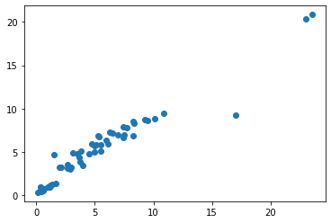
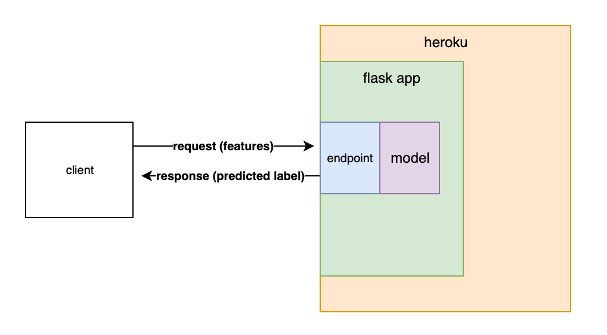

# Car Resale Price Prediction App

## Intro
Dataset from Cardekho, leading car sale platform in India, contains information about used cars, with features like km_driven, fuel type, transmission type, number of previous owners and present retail price. 

## Objective 
To predict the car resale price and to productionize the project to be used in real world

## Code and Resources
**Python version:** 3.7

**Packages:** pandas, numpy, matplotlib, seaborn, sklearn, pickle, flask, 

**Kaggle source:** https://www.kaggle.com/nehalbirla/vehicle-dataset-from-cardekho

**Github repo:** https://github.com/chekwei4/Car_Resale

**Ipynb notebook:** https://github.com/chekwei4/Car_Resale/blob/main/car_price_local.ipynb

**Heroku App:** https://car-price-app-1.herokuapp.com/

## Model Building 

Key steps:

Categorical variables were one hot encoded to give dummy variables. 

Age of car feature was created by substracting current year with year which car was bought. 

RandomizedSearchCV performed with RandomForestRegressor to give best hyperparameters. 

## Model Performance 

**R2:** 0.92

**MSE:**  1.84

**Distribution plot**

y_test against y_pred

    

**Scatter plot**

y_test against y_pred

    

## Front-End
Simple HTML file that allows user to input the key parameters required for model to predict. 

    

## Deployment

    

Key steps:

1. pickle the trained model

2. create new virtual environment and requirements.txt

3. wrap app in Flask API

4. deploy app onto Heroku, with github repo connection

**Heroku App:** https://car-price-app-1.herokuapp.com/

<!--  -->

## Credits
https://towardsdatascience.com/productionize-a-machine-learning-model-with-flask-and-heroku-8201260503d2

https://blog.usejournal.com/why-and-how-to-make-a-requirements-txt-f329c685181e

Youtube: Krish Naik, Ken Jee